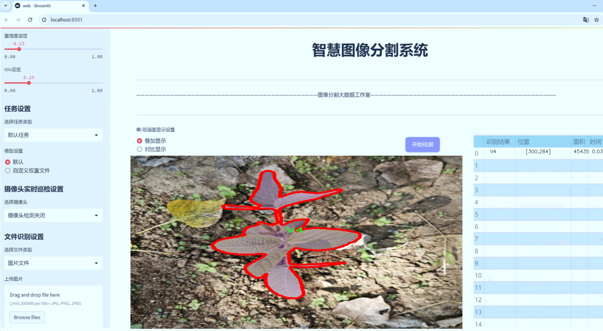
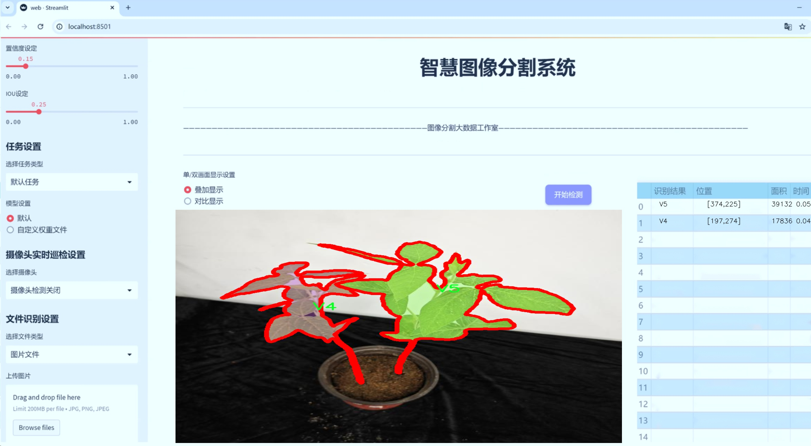
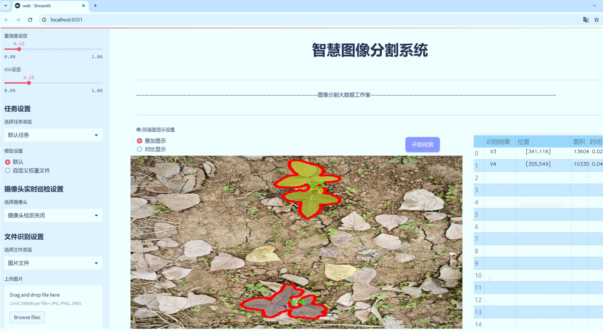
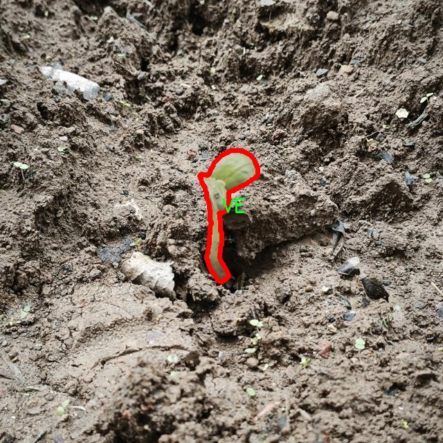
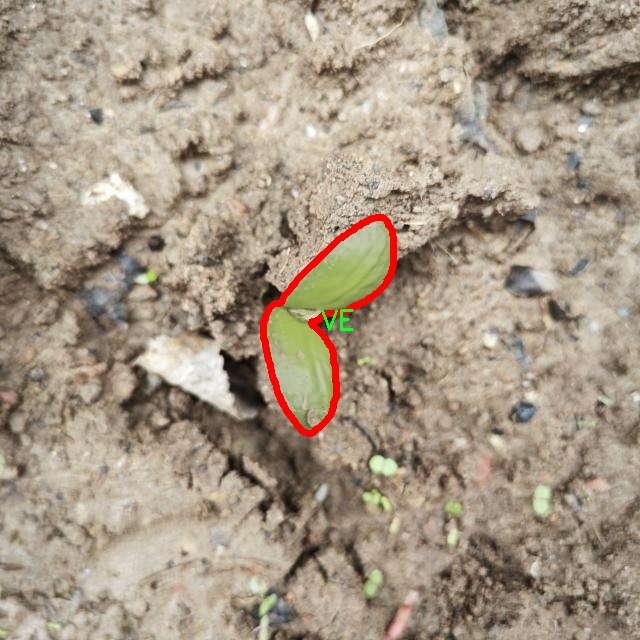
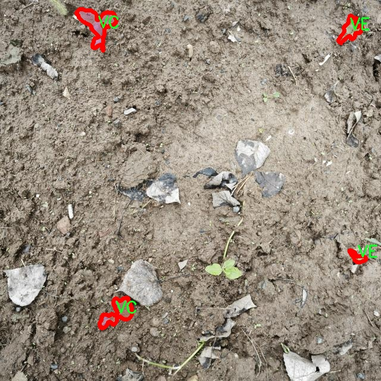
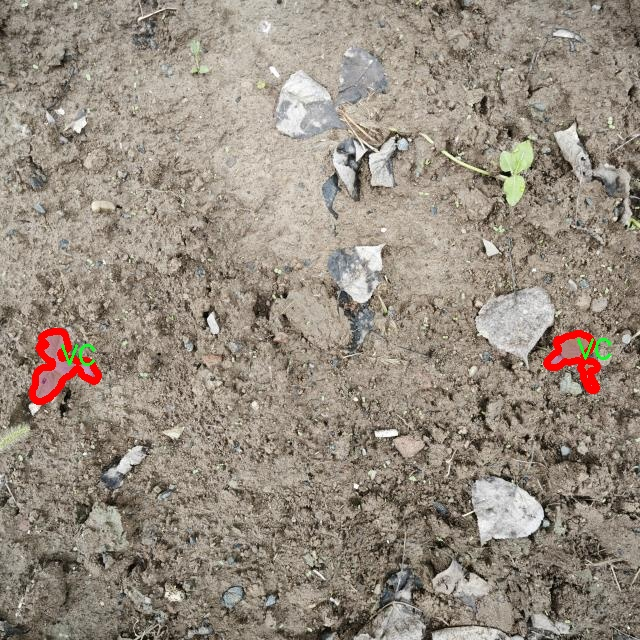
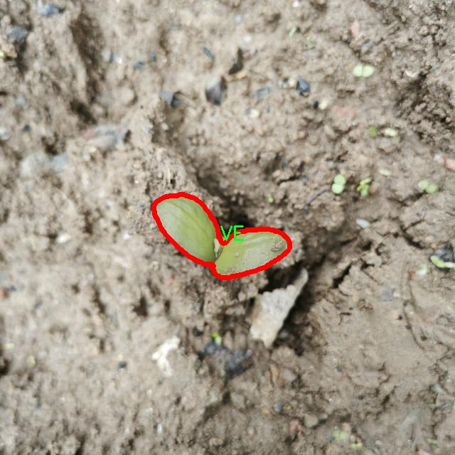

# 大豆质量分类图像分割系统源码＆数据集分享
 [yolov8-seg-C2f-DAttention＆yolov8-seg-C2f-DCNV3等50+全套改进创新点发刊_一键训练教程_Web前端展示]

### 1.研究背景与意义

项目参考[ILSVRC ImageNet Large Scale Visual Recognition Challenge](https://gitee.com/YOLOv8_YOLOv11_Segmentation_Studio/projects)

项目来源[AAAI Global Al lnnovation Contest](https://kdocs.cn/l/cszuIiCKVNis)

研究背景与意义

随着全球人口的不断增长，粮食安全问题日益凸显，而大豆作为一种重要的粮食作物，其质量直接影响到人类的饮食安全和营养健康。大豆不仅是人类的主要蛋白质来源之一，也是动物饲料和多种工业产品的重要原料。因此，确保大豆的质量，尤其是在生产、加工和流通环节，显得尤为重要。传统的大豆质量检测方法多依赖人工目测和简单的物理化学分析，这不仅效率低下，而且容易受到人为因素的影响，导致检测结果的不准确性和不一致性。因此，基于计算机视觉的自动化质量检测系统应运而生，成为提升大豆质量检测效率和准确性的有效手段。

近年来，深度学习技术的迅猛发展为图像处理和计算机视觉领域带来了革命性的变化。YOLO（You Only Look Once）系列模型因其高效的实时目标检测能力而广泛应用于各类视觉任务中。YOLOv8作为该系列的最新版本，具备更强的特征提取能力和更高的检测精度，尤其在复杂背景下的物体识别和分割任务中表现优异。因此，基于改进YOLOv8的大豆质量分类图像分割系统的研究，不仅具有重要的理论意义，也为实际应用提供了新的解决方案。

本研究将针对大豆质量分类的具体需求，构建一个基于YOLOv8的图像分割系统，旨在实现对大豆图像中不同质量类别的精准识别与分割。数据集包含1700张大豆图像，涵盖了五个类别：破损、杂质、良品、霉变和秕粒。这些类别的划分不仅反映了大豆的物理特性，也与其市场价值和消费者的选择密切相关。通过对这些类别的有效识别与分割，能够为大豆的质量评估提供更加客观和量化的依据，从而推动大豆产业的标准化和现代化进程。

此外，本研究还将探讨如何通过改进YOLOv8模型的网络结构和训练策略，提升其在大豆质量分类任务中的表现。通过引入数据增强、迁移学习等技术手段，期望在保证模型准确性的同时，提高其对不同环境和条件下大豆图像的适应能力。这不仅能够提高大豆质量检测的效率，还能为其他农作物的质量检测提供借鉴，推动农业智能化的发展。

综上所述，基于改进YOLOv8的大豆质量分类图像分割系统的研究，不仅具有重要的学术价值和技术创新意义，更将为实际生产和市场流通中的大豆质量控制提供有效的技术支持，促进农业现代化和可持续发展。因此，该研究的开展将为大豆产业链的各个环节提供科学依据，助力提升大豆的市场竞争力和消费者的信任度。

### 2.图片演示







##### 注意：由于此博客编辑较早，上面“2.图片演示”和“3.视频演示”展示的系统图片或者视频可能为老版本，新版本在老版本的基础上升级如下：（实际效果以升级的新版本为准）

  （1）适配了YOLOV8的“目标检测”模型和“实例分割”模型，通过加载相应的权重（.pt）文件即可自适应加载模型。

  （2）支持“图片识别”、“视频识别”、“摄像头实时识别”三种识别模式。

  （3）支持“图片识别”、“视频识别”、“摄像头实时识别”三种识别结果保存导出，解决手动导出（容易卡顿出现爆内存）存在的问题，识别完自动保存结果并导出到tempDir中。

  （4）支持Web前端系统中的标题、背景图等自定义修改，后面提供修改教程。

  另外本项目提供训练的数据集和训练教程,暂不提供权重文件（best.pt）,需要您按照教程进行训练后实现图片演示和Web前端界面演示的效果。

### 3.视频演示

[3.1 视频演示](https://www.bilibili.com/video/BV1nimjYgEAf/)

### 4.数据集信息展示

##### 4.1 本项目数据集详细数据（类别数＆类别名）

nc: 8
names: ['V1', 'V2', 'V3', 'V4', 'V5', 'V6', 'VC', 'VE']


##### 4.2 本项目数据集信息介绍

数据集信息展示

在现代农业领域，尤其是大豆的生产与加工过程中，确保大豆的质量至关重要。为此，开发一个高效的图像分割系统以自动化大豆质量分类显得尤为重要。本研究所使用的数据集名为“soybean quality”，该数据集专门设计用于训练和改进YOLOv8-seg模型，以实现对大豆质量的精准分类与分割。

“soybean quality”数据集包含了8个不同的类别，分别为V1、V2、V3、V4、V5、V6、VC和VE。这些类别涵盖了大豆在不同生长阶段和不同质量状态下的特征，使得模型能够在多样化的环境中进行有效的学习与推断。每个类别代表了特定的质量标准或生长阶段，V1至V6可能对应于大豆的不同成熟度或外观特征，而VC和VE则可能代表特定的病害或缺陷状态。

数据集的构建过程涉及了大量的图像采集与标注工作。研究团队通过在不同的种植环境中拍摄大豆样本，确保了数据集的多样性与代表性。这些图像不仅涵盖了大豆的不同品种，还考虑了不同的光照条件、拍摄角度和背景环境，以提高模型的鲁棒性和适应性。此外，数据集中的每一张图像都经过精确的标注，确保每个类别的特征在图像中得到清晰的体现，这对于后续的图像分割任务至关重要。

在数据预处理阶段，研究团队对图像进行了多种增强处理，包括旋转、缩放、翻转和颜色调整等，以增加数据集的多样性并提高模型的泛化能力。这些处理手段不仅丰富了训练数据的多样性，还有效地防止了模型的过拟合现象，使得训练出的模型能够在未见过的数据上表现出色。

为了评估模型的性能，研究团队将数据集划分为训练集、验证集和测试集。训练集用于模型的训练，验证集用于调优模型参数，而测试集则用于最终的性能评估。通过这种方式，研究团队能够确保模型在实际应用中的可靠性与准确性。

在实际应用中，改进后的YOLOv8-seg模型将能够实时处理大豆图像，自动识别并分类不同质量的大豆。这一系统的实现不仅能够提高大豆质量检测的效率，还能够为农民和生产者提供科学的决策支持，帮助他们在生产过程中做出更为精准的判断。

综上所述，“soybean quality”数据集为本研究提供了坚实的基础，通过对大豆质量的细致分类与分割，推动了农业智能化的发展。随着技术的不断进步，未来该数据集的应用前景将更加广阔，为农业生产的数字化转型贡献力量。











### 5.全套项目环境部署视频教程（零基础手把手教学）

[5.1 环境部署教程链接（零基础手把手教学）](https://www.bilibili.com/video/BV1jG4Ve4E9t/?vd_source=bc9aec86d164b67a7004b996143742dc)


[5.2 安装Python虚拟环境创建和依赖库安装视频教程链接（零基础手把手教学）](https://www.bilibili.com/video/BV1nA4VeYEze/?vd_source=bc9aec86d164b67a7004b996143742dc)

### 6.手把手YOLOV8-seg训练视频教程（零基础小白有手就能学会）

[6.1 手把手YOLOV8-seg训练视频教程（零基础小白有手就能学会）](https://www.bilibili.com/video/BV1cA4VeYETe/?vd_source=bc9aec86d164b67a7004b996143742dc)


按照上面的训练视频教程链接加载项目提供的数据集，运行train.py即可开始训练



     Epoch   gpu_mem       box       obj       cls    labels  img_size
     1/200     0G   0.01576   0.01955  0.007536        22      1280: 100%|██████████| 849/849 [14:42<00:00,  1.04s/it]
               Class     Images     Labels          P          R     mAP@.5 mAP@.5:.95: 100%|██████████| 213/213 [01:14<00:00,  2.87it/s]
                 all       3395      17314      0.994      0.957      0.0957      0.0843

     Epoch   gpu_mem       box       obj       cls    labels  img_size
     2/200     0G   0.01578   0.01923  0.007006        22      1280: 100%|██████████| 849/849 [14:44<00:00,  1.04s/it]
               Class     Images     Labels          P          R     mAP@.5 mAP@.5:.95: 100%|██████████| 213/213 [01:12<00:00,  2.95it/s]
                 all       3395      17314      0.996      0.956      0.0957      0.0845

     Epoch   gpu_mem       box       obj       cls    labels  img_size
     3/200     0G   0.01561    0.0191  0.006895        27      1280: 100%|██████████| 849/849 [10:56<00:00,  1.29it/s]
               Class     Images     Labels          P          R     mAP@.5 mAP@.5:.95: 100%|███████   | 187/213 [00:52<00:00,  4.04it/s]
                 all       3395      17314      0.996      0.957      0.0957      0.0845


### 7.50+种全套YOLOV8-seg创新点代码加载调参视频教程（一键加载写好的改进模型的配置文件）

[7.1 50+种全套YOLOV8-seg创新点代码加载调参视频教程（一键加载写好的改进模型的配置文件）](https://www.bilibili.com/video/BV1Hw4VePEXv/?vd_source=bc9aec86d164b67a7004b996143742dc)

### 8.YOLOV8-seg图像分割算法原理

原始YOLOv8-seg算法原理

YOLOv8-seg算法是Ultralytics团队在YOLO系列模型的基础上，结合近年来在目标检测和图像分割领域的最新研究成果而提出的一种先进的深度学习模型。自2023年1月推出以来，YOLOv8-seg凭借其高效的性能和灵活的应用，迅速成为计算机视觉领域的热门选择。该算法不仅支持目标检测，还扩展到了实例分割任务，展示了其在处理复杂场景中的强大能力。

YOLOv8-seg的网络结构由多个主要组件构成，包括输入层、主干网络、颈部网络和头部网络。首先，在输入层，YOLOv8-seg对输入图像进行预处理和缩放，以满足模型的输入尺寸要求。该过程确保了图像数据的一致性，从而提高了模型的训练效率和准确性。

主干网络是YOLOv8-seg的核心部分，负责从输入图像中提取特征。与之前的YOLO版本相比，YOLOv8-seg在主干网络中采用了C2f模块，取代了传统的C3模块。C2f模块的设计灵感来源于YOLOv7中的ELAN结构，具有更多的跳层连接，这种结构的引入不仅丰富了梯度流信息，还增强了特征提取的能力。此外，主干网络中仍然保留了SPPF模块，通过多尺度的最大池化操作，进一步提升了特征的抽象能力和表达能力。

在颈部网络中，YOLOv8-seg同样对所有的C3模块进行了替换，使用C2f模块来提高特征融合的效果。颈部网络的设计采用了特征金字塔网络（FPN）和路径聚合网络（PAN）结构，旨在有效地融合来自不同尺度的特征图信息。这种融合方式使得模型能够更好地处理各种尺寸的目标，提高了对小目标的检测能力。

YOLOv8-seg的头部网络是其创新的关键所在。该部分采用了解耦的检测头，分为两个并行的卷积分支，分别用于计算类别和位置的损失。这种设计的优势在于，分类任务和定位任务的侧重点不同，解耦的结构使得模型在处理这两种任务时能够更高效地收敛，并提高预测的精度。此外，YOLOv8-seg摒弃了传统的锚框结构，采用无锚框的方式直接预测目标的中心位置。这一变化不仅简化了模型的结构，还提升了检测速度和准确性。

在损失函数的设计上，YOLOv8-seg引入了任务对齐学习（Task Alignment Learning，TAL）机制，通过引入分类分数和IOU的高次幂乘积，来衡量任务对齐的程度。这一创新使得模型在分类和定位的损失函数中都能更好地反映目标的真实情况，从而提升了整体的检测性能。

在训练过程中，YOLOv8-seg对数据增强的策略进行了调整。尽管Mosaic数据增强在提升模型鲁棒性和泛化性方面具有一定效果，但YOLOv8-seg在训练的最后10个epoch中停止使用该方法，以避免对数据真实分布的破坏。这一策略的实施，进一步提高了模型在实际应用中的表现。

YOLOv8-seg在多个标准数据集上的表现优异，尤其是在COCO数据集上，模型的mAP（mean Average Precision）指标显示出其在检测精度和速度上的显著优势。与其他YOLO系列模型相比，YOLOv8-seg在相同尺寸下实现了更高的检测精度和更快的推理速度，证明了其在实时目标检测和实例分割任务中的有效性。

综上所述，YOLOv8-seg算法通过对网络结构的创新设计、损失函数的优化以及数据增强策略的调整，展现了其在目标检测和图像分割领域的强大能力。该算法不仅在精度和速度上超越了前代模型，还为实际应用提供了更多的灵活性和适应性。随着YOLOv8-seg的不断发展和完善，预计其将在智能监控、自动驾驶、机器人视觉等多个领域发挥更大的作用，推动计算机视觉技术的进一步进步。


### 9.系统功能展示（检测对象为举例，实际内容以本项目数据集为准）

图9.1.系统支持检测结果表格显示

  图9.2.系统支持置信度和IOU阈值手动调节

  图9.3.系统支持自定义加载权重文件best.pt(需要你通过步骤5中训练获得)

  图9.4.系统支持摄像头实时识别

  图9.5.系统支持图片识别

  图9.6.系统支持视频识别

  图9.7.系统支持识别结果文件自动保存

  图9.8.系统支持Excel导出检测结果数据


### 10.50+种全套YOLOV8-seg创新点原理讲解（非科班也可以轻松写刊发刊，V11版本正在科研待更新）

#### 10.1 由于篇幅限制，每个创新点的具体原理讲解就不一一展开，具体见下列网址中的创新点对应子项目的技术原理博客网址【Blog】：


[10.1 50+种全套YOLOV8-seg创新点原理讲解链接](https://gitee.com/qunmasj/good)

#### 10.2 部分改进模块原理讲解(完整的改进原理见上图和技术博客链接)【如果此小节的图加载失败可以通过CSDN或者Github搜索该博客的标题访问原始博客，原始博客图片显示正常】
### FasterNet简介
神经网络在图像分类、检测和分割等各种计算机视觉任务中经历了快速发展。尽管其令人印象深刻的性能为许多应用程序提供了动力，但一个巨大的趋势是追求具有低延迟和高吞吐量的快速神经网络，以获得良好的用户体验、即时响应和安全原因等。

如何快速？研究人员和从业者不需要更昂贵的计算设备，而是倾向于设计具有成本效益的快速神经网络，降低计算复杂度，主要以浮点运算（FLOPs）的数量来衡量。

MobileNet、ShuffleNet和GhostNet等利用深度卷积（DWConv）和/或组卷积（GConv）来提取空间特征。然而，在减少FLOPs的过程中，算子经常会受到内存访问增加的副作用的影响。MicroNet进一步分解和稀疏网络，将其FLOPs推至极低水平。尽管这种方法在FLOPs方面有所改进，但其碎片计算效率很低。此外，上述网络通常伴随着额外的数据操作，如级联、Shuffle和池化，这些操作的运行时间对于小型模型来说往往很重要。

除了上述纯卷积神经网络（CNNs）之外，人们对使视觉Transformer（ViTs）和多层感知器（MLP）架构更小更快也越来越感兴趣。例如，MobileViT和MobileFormer通过将DWConv与改进的注意力机制相结合，降低了计算复杂性。然而，它们仍然受到DWConv的上述问题的困扰，并且还需要修改的注意力机制的专用硬件支持。使用先进但耗时的标准化和激活层也可能限制其在设备上的速度。

所有这些问题一起导致了以下问题：这些“快速”的神经网络真的很快吗？为了回答这个问题，作者检查了延迟和FLOPs之间的关系，这由


其中FLOPS是每秒浮点运算的缩写，作为有效计算速度的度量。虽然有许多减少FLOPs的尝试，但都很少考虑同时优化FLOPs以实现真正的低延迟。为了更好地理解这种情况，作者比较了Intel CPU上典型神经网络的FLOPS。


图中的结果表明，许多现有神经网络的FLOPS较低，其FLOPS通常低于流行的ResNet50。由于FLOPS如此之低，这些“快速”的神经网络实际上不够快。它们的FLOPs减少不能转化为延迟的确切减少量。在某些情况下，没有任何改善，甚至会导致更糟的延迟。例如，CycleMLP-B1具有ResNet50的一半FLOPs，但运行速度较慢（即CycleMLPB1与ResNet50:111.9ms与69.4ms）。

请注意，FLOPs与延迟之间的差异在之前的工作中也已被注意到，但由于它们采用了DWConv/GConv和具有低FLOPs的各种数据处理，因此部分问题仍未解决。人们认为没有更好的选择。

该博客提供的方案通过开发一种简单、快速、有效的运算符来消除这种差异，该运算符可以在减少FLOPs的情况下保持高FLOPS。

具体来说，作者重新审视了现有的操作符，特别是DWConv的计算速度——FLOPS。作者发现导致低FLOPS问题的主要原因是频繁的内存访问。然后，作者提出了PConv作为一种竞争性替代方案，它减少了计算冗余以及内存访问的数量。

图1说明了PConv的设计。它利用了特征图中的冗余，并系统地仅在一部分输入通道上应用规则卷积（Conv），而不影响其余通道。本质上，PConv的FLOPs低于常规Conv，而FLOPs高于DWConv/GConv。换句话说，PConv更好地利用了设备上的计算能力。PConv在提取空间特征方面也很有效，这在本文后面的实验中得到了验证。

作者进一步引入PConv设计了FasterNet作为一个在各种设备上运行速度非常快的新网络家族。特别是，FasterNet在分类、检测和分割任务方面实现了最先进的性能，同时具有更低的延迟和更高的吞吐量。例如，在GPU、CPU和ARM处理器上，小模型FasterNet-T0分别比MobileVitXXS快3.1倍、3.1倍和2.5倍，而在ImageNet-1k上的准确率高2.9%。大模型FasterNet-L实现了83.5%的Top-1精度，与Swin-B不相上下，同时在GPU上提供了49%的高吞吐量，在CPU上节省了42%的计算时间。

总之，贡献如下：

指出了实现更高FLOPS的重要性，而不仅仅是为了更快的神经网络而减少FLOPs。

引入了一种简单但快速且有效的卷积PConv，它很有可能取代现有的选择DWConv。

推出FasterNet，它在GPU、CPU和ARM处理器等多种设备上运行良好且普遍快速。

对各种任务进行了广泛的实验，并验证了PConv和FasterNet的高速性和有效性。

### Conv和FasterNet的设计
#### 原理

DWConv是Conv的一种流行变体，已被广泛用作许多神经网络的关键构建块。对于输入，DWConv应用个滤波器来计算输出。如图（b）所示，每个滤波器在一个输入通道上进行空间滑动，并对一个输出通道做出贡献。

与具有的FLOPs常规Conv相比，这种深度计算使得DWConv仅仅具有的FLOPs。虽然在减少FLOPs方面有效，但DWConv（通常后跟逐点卷积或PWConv）不能简单地用于替换常规Conv，因为它会导致严重的精度下降。因此，在实践中，DWConv的通道数（或网络宽度）增加到＞以补偿精度下降，例如，倒置残差块中的DWConv宽度扩展了6倍。然而，这会导致更高的内存访问，这会造成不可忽略的延迟，并降低总体计算速度，尤其是对于I/O绑定设备。特别是，内存访问的数量现在上升到


它比一个常规的Conv的值要高，即，


注意，内存访问花费在I/O操作上，这被认为已经是最小的成本，很难进一步优化。

#### PConv作为一个基本的算子


在下面演示了通过利用特征图的冗余度可以进一步优化成本。如图所示，特征图在不同通道之间具有高度相似性。许多其他著作也涵盖了这种冗余，但很少有人以简单而有效的方式充分利用它。


具体而言，作者提出了一种简单的PConv，以同时减少计算冗余和内存访问。图4中的左下角说明了PConv的工作原理。它只需在输入通道的一部分上应用常规Conv进行空间特征提取，并保持其余通道不变。对于连续或规则的内存访问，将第一个或最后一个连续的通道视为整个特征图的代表进行计算。在不丧失一般性的情况下认为输入和输出特征图具有相同数量的通道。因此，PConv的FLOPs仅


对于典型的r＝1/4 ，PConv的FLOPs只有常规Conv的1/16。此外，PConv的内存访问量较小，即：


对于r＝1/4，其仅为常规Conv的1/4。

由于只有通道用于空间特征提取，人们可能会问是否可以简单地移除剩余的（c−）通道？如果是这样，PConv将退化为具有较少通道的常规Conv，这偏离了减少冗余的目标。

请注意，保持其余通道不变，而不是从特征图中删除它们。这是因为它们对后续PWConv层有用，PWConv允许特征信息流经所有通道。

#### PConv之后是PWConv


为了充分有效地利用来自所有通道的信息，进一步将逐点卷积（PWConv）附加到PConv。它们在输入特征图上的有效感受野看起来像一个T形Conv，与均匀处理补丁的常规Conv相比，它更专注于中心位置，如图5所示。为了证明这个T形感受野的合理性，首先通过计算位置的Frobenius范数来评估每个位置的重要性。


假设，如果一个职位比其他职位具有更大的Frobenius范数，则该职位往往更重要。对于正则Conv滤波器，位置处的Frobenius范数由计算，其中。


一个显著位置是具有最大Frobenius范数的位置。然后，在预训练的ResNet18中集体检查每个过滤器，找出它们的显著位置，并绘制显著位置的直方图。图6中的结果表明，中心位置是过滤器中最常见的突出位置。换句话说，中心位置的权重比周围的更重。这与集中于中心位置的T形计算一致。

虽然T形卷积可以直接用于高效计算，但作者表明，将T形卷积分解为PConv和PWConv更好，因为该分解利用了滤波器间冗余并进一步节省了FLOPs。对于相同的输入和输出，T形Conv的FLOPs可以计算为:


它高于PConv和PWConv的流量，即：


其中和（例如，当时）。此外，可以很容易地利用常规Conv进行两步实现。

# FasterNet作为Backbone
鉴于新型PConv和现成的PWConv作为主要的算子，进一步提出FasterNet，这是一个新的神经网络家族，运行速度非常快，对许多视觉任务非常有效。目标是使体系结构尽可能简单，使其总体上对硬件友好。


在图中展示了整体架构。它有4个层次级，每个层次级前面都有一个嵌入层（步长为4的常规4×4卷积）或一个合并层（步长为2的常规2×2卷积），用于空间下采样和通道数量扩展。每个阶段都有一堆FasterNet块。作者观察到，最后两个阶段中的块消耗更少的内存访问，并且倾向于具有更高的FLOPS，如表1中的经验验证。因此，放置了更多FasterNet块，并相应地将更多计算分配给最后两个阶段。每个FasterNet块有一个PConv层，后跟2个PWConv（或Conv 1×1）层。它们一起显示为倒置残差块，其中中间层具有扩展的通道数量，并且放置了Shorcut以重用输入特征。

除了上述算子，标准化和激活层对于高性能神经网络也是不可或缺的。然而，许多先前的工作在整个网络中过度使用这些层，这可能会限制特征多样性，从而损害性能。它还可以降低整体计算速度。相比之下，只将它们放在每个中间PWConv之后，以保持特征多样性并实现较低的延迟。

此外，使用批次归一化（BN）代替其他替代方法。BN的优点是，它可以合并到其相邻的Conv层中，以便更快地进行推断，同时与其他层一样有效。对于激活层，根据经验选择了GELU用于较小的FasterNet变体，而ReLU用于较大的FasterNet变体，同时考虑了运行时间和有效性。最后三个层，即全局平均池化、卷积1×1和全连接层，一起用于特征转换和分类。

为了在不同的计算预算下提供广泛的应用，提供FasterNet的Tiny模型、Small模型、Medium模型和Big模型变体，分别称为FasterNetT0/1/2、FasterNet-S、FasterNet-M和FasterNet-L。它们具有相似的结构，但深度和宽度不同。

架构规范如下：


### 11.项目核心源码讲解（再也不用担心看不懂代码逻辑）

#### 11.1 ultralytics\models\yolo\classify\predict.py

以下是对给定代码的核心部分进行提炼和详细注释的结果：

```python
# 导入必要的库
import torch
from ultralytics.engine.predictor import BasePredictor
from ultralytics.engine.results import Results
from ultralytics.utils import DEFAULT_CFG, ops

class ClassificationPredictor(BasePredictor):
    """
    ClassificationPredictor类，继承自BasePredictor类，用于基于分类模型进行预测。
    
    注意：
        - 可以将Torchvision分类模型传递给'model'参数，例如：model='resnet18'。
    """

    def __init__(self, cfg=DEFAULT_CFG, overrides=None, _callbacks=None):
        """初始化ClassificationPredictor，将任务设置为'分类'。"""
        super().__init__(cfg, overrides, _callbacks)  # 调用父类构造函数
        self.args.task = 'classify'  # 设置任务类型为分类

    def preprocess(self, img):
        """将输入图像转换为模型兼容的数据类型。"""
        # 如果输入不是torch.Tensor类型，则进行转换
        if not isinstance(img, torch.Tensor):
            img = torch.stack([self.transforms(im) for im in img], dim=0)  # 应用预处理变换并堆叠成Tensor
        # 将图像移动到模型所在的设备（CPU或GPU）
        img = (img if isinstance(img, torch.Tensor) else torch.from_numpy(img)).to(self.model.device)
        # 根据模型的精度设置将图像转换为半精度（fp16）或单精度（fp32）
        return img.half() if self.model.fp16 else img.float()  # uint8 转换为 fp16/32

    def postprocess(self, preds, img, orig_imgs):
        """对预测结果进行后处理，返回Results对象。"""
        # 如果原始图像不是列表，则将其转换为numpy数组
        if not isinstance(orig_imgs, list):
            orig_imgs = ops.convert_torch2numpy_batch(orig_imgs)

        results = []  # 存储结果的列表
        # 遍历每个预测结果
        for i, pred in enumerate(preds):
            orig_img = orig_imgs[i]  # 获取对应的原始图像
            img_path = self.batch[0][i]  # 获取图像路径
            # 创建Results对象并添加到结果列表中
            results.append(Results(orig_img, path=img_path, names=self.model.names, probs=pred))
        return results  # 返回处理后的结果列表
```

### 代码分析与注释说明：

1. **导入模块**：导入了必要的PyTorch库和Ultralytics的相关模块。
2. **ClassificationPredictor类**：该类专门用于分类任务，继承自`BasePredictor`，实现了分类模型的预测功能。
3. **构造函数**：初始化时调用父类构造函数，并设置任务类型为分类。
4. **预处理方法**：将输入图像转换为适合模型处理的格式，包括将图像转换为Tensor并移动到相应的设备上，同时根据模型的精度设置数据类型。
5. **后处理方法**：对模型的预测结果进行处理，生成`Results`对象，便于后续使用和分析。

通过这些核心部分和详细注释，可以更好地理解代码的功能和结构。

这个文件是一个用于图像分类的预测器类，名为 `ClassificationPredictor`，它继承自 `BasePredictor` 类。该类主要用于处理基于分类模型的预测任务，特别是与 YOLO（You Only Look Once）模型相关的分类任务。

在文件开头，首先导入了必要的库，包括 `torch` 和一些来自 `ultralytics` 的模块。`torch` 是 PyTorch 的核心库，用于深度学习的张量计算和模型构建。`BasePredictor` 是一个基础预测器类，提供了一些通用的预测功能，而 `Results` 类则用于封装预测结果。

`ClassificationPredictor` 类的构造函数 `__init__` 接受三个参数：`cfg`（配置），`overrides`（覆盖配置），和 `_callbacks`（回调函数）。在初始化时，它调用父类的构造函数，并将任务类型设置为 'classify'，表示这是一个分类任务。

`preprocess` 方法用于对输入图像进行预处理，以便将其转换为模型可以接受的数据格式。首先，它检查输入图像是否为 PyTorch 张量，如果不是，则将其转换为张量。接着，图像会被移动到模型所在的设备（CPU 或 GPU），并根据模型的精度（fp16 或 fp32）进行类型转换。

`postprocess` 方法用于对模型的预测结果进行后处理，以返回 `Results` 对象。该方法首先检查原始图像是否为列表，如果不是，则将其转换为 NumPy 数组。然后，它遍历每个预测结果，将其与原始图像和图像路径结合，创建 `Results` 对象并将其添加到结果列表中，最终返回这个结果列表。

整体来看，这个文件的主要功能是实现图像分类的预测流程，包括图像的预处理和预测结果的后处理，使得用户能够方便地使用 YOLO 模型进行图像分类任务。

#### 11.2 ui.py

```python
import sys
import subprocess

def run_script(script_path):
    """
    使用当前 Python 环境运行指定的脚本。

    Args:
        script_path (str): 要运行的脚本路径

    Returns:
        None
    """
    # 获取当前 Python 解释器的路径
    python_path = sys.executable

    # 构建运行命令
    command = f'"{python_path}" -m streamlit run "{script_path}"'

    # 执行命令
    result = subprocess.run(command, shell=True)
    if result.returncode != 0:
        print("脚本运行出错。")


# 实例化并运行应用
if __name__ == "__main__":
    # 指定您的脚本路径
    script_path = "web.py"  # 这里可以直接指定脚本名称

    # 运行脚本
    run_script(script_path)
```

### 代码核心部分及注释

1. **导入模块**：
   ```python
   import sys
   import subprocess
   ```
   - `sys`模块用于访问与Python解释器紧密相关的变量和函数。
   - `subprocess`模块允许我们生成新的进程，连接到它们的输入/输出/错误管道，并获得它们的返回码。

2. **定义`run_script`函数**：
   ```python
   def run_script(script_path):
   ```
   - 该函数接受一个参数`script_path`，表示要运行的Python脚本的路径。

3. **获取当前Python解释器路径**：
   ```python
   python_path = sys.executable
   ```
   - `sys.executable`返回当前Python解释器的路径，这样可以确保我们使用的是当前环境中的Python。

4. **构建运行命令**：
   ```python
   command = f'"{python_path}" -m streamlit run "{script_path}"'
   ```
   - 使用f-string格式化字符串，构建一个命令行指令，使用`streamlit`模块运行指定的脚本。

5. **执行命令**：
   ```python
   result = subprocess.run(command, shell=True)
   ```
   - `subprocess.run`用于执行构建的命令，`shell=True`表示在shell中执行命令。

6. **检查命令执行结果**：
   ```python
   if result.returncode != 0:
       print("脚本运行出错。")
   ```
   - 检查命令的返回码，如果不为0，表示脚本运行出错，打印错误信息。

7. **主程序入口**：
   ```python
   if __name__ == "__main__":
   ```
   - 该部分确保只有在直接运行该脚本时才会执行以下代码。

8. **指定脚本路径并运行**：
   ```python
   script_path = "web.py"  # 这里可以直接指定脚本名称
   run_script(script_path)
   ```
   - 指定要运行的脚本路径，并调用`run_script`函数执行该脚本。

这个程序文件的主要功能是通过当前的 Python 环境来运行一个指定的脚本，具体是一个名为 `web.py` 的文件。首先，程序导入了必要的模块，包括 `sys`、`os` 和 `subprocess`，这些模块提供了与系统交互和执行外部命令的功能。此外，还导入了 `abs_path` 函数，这个函数来自于 `QtFusion.path` 模块，用于获取文件的绝对路径。

在 `run_script` 函数中，首先获取当前 Python 解释器的路径，使用 `sys.executable` 来实现。接着，构建一个命令字符串，这个命令使用了 `streamlit` 来运行指定的脚本。`streamlit` 是一个用于构建数据应用的框架，命令的格式是将 Python 解释器与 `-m streamlit run` 结合，后面跟上要运行的脚本路径。

然后，使用 `subprocess.run` 方法来执行这个命令。这个方法会在一个新的 shell 中运行命令，并等待其完成。如果命令执行的返回码不为零，表示脚本运行过程中出现了错误，程序会打印出相应的错误信息。

在文件的最后部分，使用 `if __name__ == "__main__":` 来确保当该文件作为主程序运行时，才会执行下面的代码。这里指定了要运行的脚本路径，即 `web.py`，并调用 `run_script` 函数来执行这个脚本。

总体来说，这个程序的目的是为了方便地通过当前的 Python 环境来运行一个 Streamlit 应用脚本，并且在执行过程中能够处理可能出现的错误。

#### 11.3 ultralytics\models\yolo\model.py

```python
# 导入必要的模块和类
from ultralytics.engine.model import Model
from ultralytics.models import yolo  # noqa
from ultralytics.nn.tasks import ClassificationModel, DetectionModel, PoseModel, SegmentationModel

class YOLO(Model):
    """YOLO (You Only Look Once) 目标检测模型的定义。"""

    @property
    def task_map(self):
        """将任务类型映射到相应的模型、训练器、验证器和预测器类。"""
        return {
            'classify': {  # 分类任务
                'model': ClassificationModel,  # 分类模型
                'trainer': yolo.classify.ClassificationTrainer,  # 分类训练器
                'validator': yolo.classify.ClassificationValidator,  # 分类验证器
                'predictor': yolo.classify.ClassificationPredictor,  # 分类预测器
            },
            'detect': {  # 检测任务
                'model': DetectionModel,  # 检测模型
                'trainer': yolo.detect.DetectionTrainer,  # 检测训练器
                'validator': yolo.detect.DetectionValidator,  # 检测验证器
                'predictor': yolo.detect.DetectionPredictor,  # 检测预测器
            },
            'segment': {  # 分割任务
                'model': SegmentationModel,  # 分割模型
                'trainer': yolo.segment.SegmentationTrainer,  # 分割训练器
                'validator': yolo.segment.SegmentationValidator,  # 分割验证器
                'predictor': yolo.segment.SegmentationPredictor,  # 分割预测器
            },
            'pose': {  # 姿态估计任务
                'model': PoseModel,  # 姿态模型
                'trainer': yolo.pose.PoseTrainer,  # 姿态训练器
                'validator': yolo.pose.PoseValidator,  # 姿态验证器
                'predictor': yolo.pose.PosePredictor,  # 姿态预测器
            },
        }
```

### 代码核心部分说明：
1. **导入模块**：首先导入了必要的模块和类，这些模块提供了YOLO模型的基础功能和各种任务的实现。
2. **YOLO类**：定义了一个`YOLO`类，继承自`Model`类，表示YOLO目标检测模型。
3. **task_map属性**：这个属性返回一个字典，映射了不同任务（分类、检测、分割、姿态估计）到相应的模型、训练器、验证器和预测器。这使得在使用YOLO模型时，可以根据任务类型灵活选择相应的组件。

这个程序文件定义了一个名为 `YOLO` 的类，继承自 `Model` 类，主要用于实现 YOLO（You Only Look Once）目标检测模型。文件的开头包含了版权信息，表明该代码遵循 AGPL-3.0 许可证。

在 `YOLO` 类中，有一个名为 `task_map` 的属性，这个属性返回一个字典，字典的结构将不同的任务类型（如分类、检测、分割和姿态估计）映射到相应的模型、训练器、验证器和预测器类。具体来说：

- 对于分类任务，映射到 `ClassificationModel` 及其对应的训练、验证和预测类。
- 对于检测任务，映射到 `DetectionModel` 及其对应的训练、验证和预测类。
- 对于分割任务，映射到 `SegmentationModel` 及其对应的训练、验证和预测类。
- 对于姿态估计任务，映射到 `PoseModel` 及其对应的训练、验证和预测类。

这种设计使得 `YOLO` 类能够灵活地处理不同类型的计算机视觉任务，通过使用相应的模型和工具来完成特定的功能。整体上，这段代码展示了如何组织和管理与 YOLO 相关的各种任务和功能，使得模型的使用更加模块化和易于扩展。

#### 11.4 ultralytics\utils\autobatch.py

以下是代码中最核心的部分，并附上详细的中文注释：

```python
import numpy as np
import torch
from ultralytics.utils import LOGGER, colorstr
from ultralytics.utils.torch_utils import profile

def check_train_batch_size(model, imgsz=640, amp=True):
    """
    检查YOLO训练的最佳批量大小，使用autobatch()函数。

    参数:
        model (torch.nn.Module): 要检查批量大小的YOLO模型。
        imgsz (int): 用于训练的图像大小。
        amp (bool): 如果为True，则在训练中使用自动混合精度（AMP）。

    返回:
        (int): 使用autobatch()函数计算的最佳批量大小。
    """
    with torch.cuda.amp.autocast(amp):
        return autobatch(deepcopy(model).train(), imgsz)  # 计算最佳批量大小

def autobatch(model, imgsz=640, fraction=0.60, batch_size=16):
    """
    自动估计最佳YOLO批量大小，以使用可用CUDA内存的一部分。

    参数:
        model (torch.nn.Module): 要计算批量大小的YOLO模型。
        imgsz (int, optional): 用作YOLO模型输入的图像大小。默认为640。
        fraction (float, optional): 要使用的可用CUDA内存的比例。默认为0.60。
        batch_size (int, optional): 如果检测到错误时使用的默认批量大小。默认为16。

    返回:
        (int): 最佳批量大小。
    """
    
    # 检查设备
    prefix = colorstr('AutoBatch: ')
    LOGGER.info(f'{prefix}计算imgsz={imgsz}的最佳批量大小')
    device = next(model.parameters()).device  # 获取模型设备
    if device.type == 'cpu':
        LOGGER.info(f'{prefix}未检测到CUDA，使用默认CPU批量大小 {batch_size}')
        return batch_size
    if torch.backends.cudnn.benchmark:
        LOGGER.info(f'{prefix} ⚠️ 需要torch.backends.cudnn.benchmark=False，使用默认批量大小 {batch_size}')
        return batch_size

    # 检查CUDA内存
    gb = 1 << 30  # 字节转换为GiB (1024 ** 3)
    properties = torch.cuda.get_device_properties(device)  # 获取设备属性
    t = properties.total_memory / gb  # GiB总内存
    r = torch.cuda.memory_reserved(device) / gb  # GiB已保留内存
    a = torch.cuda.memory_allocated(device) / gb  # GiB已分配内存
    f = t - (r + a)  # GiB可用内存
    LOGGER.info(f'{prefix}{device} ({properties.name}) {t:.2f}G 总内存, {r:.2f}G 已保留, {a:.2f}G 已分配, {f:.2f}G 可用')

    # 评估批量大小
    batch_sizes = [1, 2, 4, 8, 16]  # 预定义的批量大小
    try:
        img = [torch.empty(b, 3, imgsz, imgsz) for b in batch_sizes]  # 创建空图像张量
        results = profile(img, model, n=3, device=device)  # 评估模型性能

        # 拟合解决方案
        y = [x[2] for x in results if x]  # 提取内存使用情况
        p = np.polyfit(batch_sizes[:len(y)], y, deg=1)  # 一次多项式拟合
        b = int((f * fraction - p[1]) / p[0])  # 计算最佳批量大小
        if None in results:  # 如果某些大小失败
            i = results.index(None)  # 找到第一个失败的索引
            if b >= batch_sizes[i]:  # 如果最佳批量大小超过失败点
                b = batch_sizes[max(i - 1, 0)]  # 选择之前的安全点
        if b < 1 or b > 1024:  # 如果最佳批量大小超出安全范围
            b = batch_size
            LOGGER.info(f'{prefix}警告 ⚠️ 检测到CUDA异常，使用默认批量大小 {batch_size}.')

        fraction = (np.polyval(p, b) + r + a) / t  # 计算实际使用的内存比例
        LOGGER.info(f'{prefix}使用批量大小 {b}，内存使用 {t * fraction:.2f}G/{t:.2f}G ({fraction * 100:.0f}%) ✅')
        return b
    except Exception as e:
        LOGGER.warning(f'{prefix}警告 ⚠️ 检测到错误: {e}, 使用默认批量大小 {batch_size}.')
        return batch_size
```

### 代码核心部分说明：
1. **check_train_batch_size**: 该函数用于检查给定YOLO模型的最佳训练批量大小。它使用`autobatch`函数来计算最佳批量大小，并支持自动混合精度（AMP）。

2. **autobatch**: 该函数自动估计最佳批量大小，以使用可用CUDA内存的一部分。它首先检查设备类型和CUDA内存情况，然后通过评估不同批量大小的内存使用情况来拟合最佳批量大小。

3. **CUDA内存检查**: 代码中获取了CUDA设备的总内存、已保留内存和已分配内存，以计算可用内存，并在日志中输出相关信息。

4. **批量大小评估**: 通过创建不同批量大小的空张量并使用`profile`函数评估模型性能，最终确定最佳批量大小，并进行必要的异常处理。

这个程序文件`ultralytics/utils/autobatch.py`主要用于在PyTorch中估算最佳的YOLO模型训练批量大小，以便合理利用可用的CUDA内存。文件中包含了几个重要的函数和步骤。

首先，文件导入了一些必要的库，包括`deepcopy`用于深拷贝模型，`numpy`用于数值计算，`torch`用于深度学习框架的操作。此外，还引入了`ultralytics`中的一些工具和默认配置。

在`check_train_batch_size`函数中，输入参数包括YOLO模型、图像大小和是否使用自动混合精度（AMP）。该函数会在AMP上下文中调用`autobatch`函数，返回计算出的最佳批量大小。通过深拷贝模型，确保在计算批量大小时不会影响原始模型的状态。

`autobatch`函数是核心部分，负责自动估算最佳的批量大小。它接受模型、图像大小、使用的CUDA内存比例和默认批量大小作为参数。首先，它检查模型所在的设备，如果是CPU，则直接返回默认的批量大小。如果CUDA未启用或CUDNN的基准模式开启，函数也会返回默认的批量大小。

接下来，函数会检查CUDA内存的使用情况，包括总内存、已保留内存和已分配内存，从而计算出可用的自由内存。然后，函数定义了一组可能的批量大小，并通过创建相应大小的空张量来对这些批量大小进行性能分析。

在性能分析后，函数会使用一阶多项式拟合来估算最佳批量大小。如果在分析过程中某些批量大小失败，函数会选择安全的先前批量大小。如果计算出的批量大小不在安全范围内（小于1或大于1024），则会使用默认的批量大小，并记录警告信息。

最后，函数会记录使用的批量大小和内存使用情况，并返回计算出的最佳批量大小。如果在执行过程中发生异常，函数会捕获并记录警告，返回默认的批量大小。

总体而言，这个文件的功能是帮助用户在训练YOLO模型时，自动调整批量大小，以便更高效地利用GPU资源，从而提高训练效率。

#### 11.5 ultralytics\models\rtdetr\model.py

```python
# Ultralytics YOLO 🚀, AGPL-3.0 license
"""
RT-DETR接口，基于视觉变换器的实时目标检测器。RT-DETR提供实时性能和高准确性，
在CUDA和TensorRT等加速后端表现出色。它具有高效的混合编码器和IoU感知查询选择，
以提高检测准确性。

有关RT-DETR的更多信息，请访问：https://arxiv.org/pdf/2304.08069.pdf
"""

from ultralytics.engine.model import Model  # 导入基础模型类
from ultralytics.nn.tasks import RTDETRDetectionModel  # 导入RT-DETR检测模型

from .predict import RTDETRPredictor  # 导入预测器
from .train import RTDETRTrainer  # 导入训练器
from .val import RTDETRValidator  # 导入验证器


class RTDETR(Model):
    """
    RT-DETR模型接口。该基于视觉变换器的目标检测器提供实时性能和高准确性。
    它支持高效的混合编码、IoU感知查询选择和可调的推理速度。

    属性:
        model (str): 预训练模型的路径。默认为'rtdetr-l.pt'。
    """

    def __init__(self, model='rtdetr-l.pt') -> None:
        """
        使用给定的预训练模型文件初始化RT-DETR模型。支持.pt和.yaml格式。

        参数:
            model (str): 预训练模型的路径。默认为'rtdetr-l.pt'。

        异常:
            NotImplementedError: 如果模型文件扩展名不是'pt'、'yaml'或'yml'。
        """
        # 检查模型文件扩展名是否有效
        if model and model.split('.')[-1] not in ('pt', 'yaml', 'yml'):
            raise NotImplementedError('RT-DETR仅支持从*.pt、*.yaml或*.yml文件创建。')
        # 调用父类构造函数，初始化模型
        super().__init__(model=model, task='detect')

    @property
    def task_map(self) -> dict:
        """
        返回RT-DETR的任务映射，将任务与相应的Ultralytics类关联。

        返回:
            dict: 一个字典，将任务名称映射到RT-DETR模型的Ultralytics任务类。
        """
        return {
            'detect': {
                'predictor': RTDETRPredictor,  # 预测器类
                'validator': RTDETRValidator,  # 验证器类
                'trainer': RTDETRTrainer,      # 训练器类
                'model': RTDETRDetectionModel   # RT-DETR检测模型类
            }
        }
```

### 代码核心部分说明：
1. **RTDETR类**：这是RT-DETR模型的核心接口，继承自`Model`类，负责初始化模型和管理任务映射。
2. **初始化方法**：`__init__`方法中检查模型文件的有效性，确保只接受特定格式的文件（.pt, .yaml, .yml），并调用父类的初始化方法。
3. **任务映射**：`task_map`属性返回一个字典，映射了不同的任务（如预测、验证和训练）到相应的处理类。这使得模型可以灵活地处理不同的任务。

这个程序文件是一个用于实现百度的RT-DETR（实时目标检测器）的接口，RT-DETR基于视觉变换器（Vision Transformer）架构，旨在提供实时性能和高准确性，特别是在使用CUDA和TensorRT等加速后端时表现优异。文件开头包含了对RT-DETR的简要介绍，并提供了相关文献的链接。

在代码中，首先导入了必要的模块，包括Ultralytics库中的Model类和RTDETRDetectionModel类，以及用于预测、训练和验证的相关模块。接着定义了一个名为RTDETR的类，它继承自Model类。

RTDETR类的构造函数接受一个参数model，默认值为'rtdetr-l.pt'，用于指定预训练模型的路径。构造函数中检查了模型文件的扩展名，确保其为支持的格式（.pt、.yaml或.yml），如果不符合要求，则抛出NotImplementedError异常。通过调用父类的构造函数，初始化了模型并指定任务为'detect'。

该类还定义了一个名为task_map的属性，它返回一个字典，将任务名称映射到相应的Ultralytics任务类。这个字典包含了与目标检测相关的类，包括预测器（predictor）、验证器（validator）、训练器（trainer）和模型（model），使得RT-DETR能够在不同的任务中进行有效的调用和管理。

总的来说，这个文件为RT-DETR模型提供了一个清晰的接口，方便用户进行目标检测任务的实现和管理。

#### 11.6 train.py

以下是代码中最核心的部分，并附上详细的中文注释：

```python
import os
import torch
import yaml
from ultralytics import YOLO  # 导入YOLO模型库

if __name__ == '__main__':  # 确保该模块被直接运行时才执行以下代码
    # 设置训练参数
    workers = 1  # 数据加载的工作进程数
    batch = 8  # 每个批次的样本数量
    device = "0" if torch.cuda.is_available() else "cpu"  # 判断是否使用GPU

    # 获取数据集的yaml配置文件的绝对路径
    data_path = abs_path(f'datasets/data/data.yaml', path_type='current')

    # 将路径格式转换为Unix风格
    unix_style_path = data_path.replace(os.sep, '/')
    # 获取目录路径
    directory_path = os.path.dirname(unix_style_path)

    # 读取YAML文件，保持原有顺序
    with open(data_path, 'r') as file:
        data = yaml.load(file, Loader=yaml.FullLoader)

    # 修改YAML文件中的训练、验证和测试数据路径
    if 'train' in data and 'val' in data and 'test' in data:
        data['train'] = directory_path + '/train'  # 设置训练数据路径
        data['val'] = directory_path + '/val'      # 设置验证数据路径
        data['test'] = directory_path + '/test'    # 设置测试数据路径

        # 将修改后的数据写回YAML文件
        with open(data_path, 'w') as file:
            yaml.safe_dump(data, file, sort_keys=False)

    # 加载YOLO模型配置文件和预训练权重
    model = YOLO(r"C:\codeseg\codenew\50+种YOLOv8算法改进源码大全和调试加载训练教程（非必要）\改进YOLOv8模型配置文件\yolov8-seg-C2f-Faster.yaml").load("./weights/yolov8s-seg.pt")

    # 开始训练模型
    results = model.train(
        data=data_path,  # 指定训练数据的配置文件路径
        device=device,  # 指定使用的设备（GPU或CPU）
        workers=workers,  # 指定数据加载的工作进程数
        imgsz=640,  # 指定输入图像的大小为640x640
        epochs=100,  # 指定训练的轮数为100
        batch=batch,  # 指定每个批次的样本数量
    )
```

### 代码核心部分说明：
1. **导入必要的库**：导入了处理文件路径、深度学习框架、YAML文件处理和YOLO模型的相关库。
2. **设置训练参数**：定义了数据加载的工作进程数、批次大小和设备类型（GPU或CPU）。
3. **读取和修改YAML配置文件**：读取数据集的配置文件，修改训练、验证和测试数据的路径，并将修改后的内容写回文件。
4. **加载YOLO模型**：根据指定的配置文件和预训练权重加载YOLO模型。
5. **训练模型**：调用模型的训练方法，传入数据路径、设备、工作进程数、图像大小、训练轮数和批次大小等参数。

该程序文件`train.py`主要用于训练YOLO（You Only Look Once）模型，具体是YOLOv8的一个变种，使用PyTorch框架进行深度学习训练。程序的整体结构是以`if __name__ == '__main__':`为入口，确保只有在直接运行该脚本时才会执行后续代码。

首先，程序导入了必要的库，包括`os`、`torch`、`yaml`和`ultralytics`中的YOLO模型。接着，程序设置了一些训练参数，例如工作进程数`workers`、批次大小`batch`和设备选择`device`。设备选择会根据是否有可用的GPU（CUDA）来决定，如果有则使用GPU，否则使用CPU。

接下来，程序通过`abs_path`函数获取数据集配置文件`data.yaml`的绝对路径，并将路径格式转换为Unix风格。然后，程序提取该路径的目录部分，以便后续构建训练、验证和测试数据集的路径。

程序读取`data.yaml`文件，使用`yaml`库保持原有的顺序。它检查文件中是否包含`train`、`val`和`test`的路径项，如果存在，则将这些路径修改为相对于当前目录的绝对路径。修改后的数据会被写回到原来的YAML文件中。

在模型加载部分，程序创建了一个YOLO模型实例，指定了模型的配置文件路径和预训练权重文件的路径。接着，调用`model.train()`方法开始训练模型，传入的参数包括数据配置文件路径、设备、工作进程数、输入图像大小、训练轮数和批次大小。

总的来说，该程序的主要功能是设置训练环境、加载数据集和模型配置，并启动YOLO模型的训练过程。用户可以根据自己的计算资源和需求调整批次大小和其他参数，以便更好地适应训练任务。

### 12.系统整体结构（节选）

### 整体功能和构架概括

该项目主要围绕YOLO（You Only Look Once）和RT-DETR（实时目标检测器）模型的实现与训练，结合了图像分类、目标检测和自动批量大小调整等功能。项目结构模块化，便于扩展和维护。以下是各个模块的主要功能：

- **模型定义与预测**：包括YOLO和RT-DETR模型的定义、训练、验证和预测功能。
- **数据处理**：处理数据集的构建和加载，确保数据的正确格式和路径。
- **训练管理**：提供训练过程的管理，包括批量大小的自动调整和训练参数的设置。
- **用户界面**：提供用户与模型交互的界面，便于启动和管理训练过程。

### 文件功能整理表

| 文件路径                                         | 功能描述                                                                                     |
|--------------------------------------------------|----------------------------------------------------------------------------------------------|
| `ultralytics/models/yolo/classify/predict.py`   | 实现图像分类的预测功能，包括输入图像的预处理和预测结果的后处理。                          |
| `ultralytics/utils/callbacks/dvc.py`            | 提供与数据版本控制（DVC）相关的回调功能，帮助管理数据集和模型版本。                       |
| `ui.py`                                         | 通过当前Python环境运行指定的Streamlit应用脚本，提供用户界面功能。                          |
| `ultralytics/models/yolo/model.py`               | 定义YOLO模型类，支持不同计算机视觉任务的映射和管理。                                        |
| `ultralytics/utils/autobatch.py`                | 自动估算最佳批量大小，以优化YOLO模型训练过程中的CUDA内存使用。                            |
| `ultralytics/models/rtdetr/model.py`            | 实现RT-DETR模型的接口，支持目标检测任务的执行。                                            |
| `train.py`                                      | 设置训练环境，加载数据集和模型配置，并启动YOLO模型的训练过程。                            |
| `model.py`                                      | 定义模型的基本结构和功能，可能是一个通用的模型类或基类。                                   |
| `ultralytics/models/sam/modules/encoders.py`    | 实现SAM（Segment Anything Model）模块的编码器部分，支持图像分割任务。                     |
| `ultralytics/data/build.py`                     | 处理数据集的构建和加载，确保数据的正确格式和路径。                                        |
| `ultralytics/models/yolo/detect/train.py`       | 具体实现YOLO目标检测模型的训练过程，可能包含数据加载、模型训练和评估的逻辑。             |
| `ultralytics/nn/extra_modules/block.py`         | 定义额外的神经网络模块，可能用于构建复杂的网络结构或增强模型的功能。                      |
| `ultralytics/models/sam/__init__.py`            | 初始化SAM模块，可能包括对模块的导入和基本配置。                                           |

这个表格总结了项目中各个文件的主要功能，便于理解项目的整体结构和模块之间的关系。

注意：由于此博客编辑较早，上面“11.项目核心源码讲解（再也不用担心看不懂代码逻辑）”中部分代码可能会优化升级，仅供参考学习，完整“训练源码”、“Web前端界面”和“50+种创新点源码”以“14.完整训练+Web前端界面+50+种创新点源码、数据集获取”的内容为准。

### 13.图片、视频、摄像头图像分割Demo(去除WebUI)代码

在这个博客小节中，我们将讨论如何在不使用WebUI的情况下，实现图像分割模型的使用。本项目代码已经优化整合，方便用户将分割功能嵌入自己的项目中。
核心功能包括图片、视频、摄像头图像的分割，ROI区域的轮廓提取、类别分类、周长计算、面积计算、圆度计算以及颜色提取等。
这些功能提供了良好的二次开发基础。

### 核心代码解读

以下是主要代码片段，我们会为每一块代码进行详细的批注解释：

```python
import random
import cv2
import numpy as np
from PIL import ImageFont, ImageDraw, Image
from hashlib import md5
from model import Web_Detector
from chinese_name_list import Label_list

# 根据名称生成颜色
def generate_color_based_on_name(name):
    ......

# 计算多边形面积
def calculate_polygon_area(points):
    return cv2.contourArea(points.astype(np.float32))

...
# 绘制中文标签
def draw_with_chinese(image, text, position, font_size=20, color=(255, 0, 0)):
    image_pil = Image.fromarray(cv2.cvtColor(image, cv2.COLOR_BGR2RGB))
    draw = ImageDraw.Draw(image_pil)
    font = ImageFont.truetype("simsun.ttc", font_size, encoding="unic")
    draw.text(position, text, font=font, fill=color)
    return cv2.cvtColor(np.array(image_pil), cv2.COLOR_RGB2BGR)

# 动态调整参数
def adjust_parameter(image_size, base_size=1000):
    max_size = max(image_size)
    return max_size / base_size

# 绘制检测结果
def draw_detections(image, info, alpha=0.2):
    name, bbox, conf, cls_id, mask = info['class_name'], info['bbox'], info['score'], info['class_id'], info['mask']
    adjust_param = adjust_parameter(image.shape[:2])
    spacing = int(20 * adjust_param)

    if mask is None:
        x1, y1, x2, y2 = bbox
        aim_frame_area = (x2 - x1) * (y2 - y1)
        cv2.rectangle(image, (x1, y1), (x2, y2), color=(0, 0, 255), thickness=int(3 * adjust_param))
        image = draw_with_chinese(image, name, (x1, y1 - int(30 * adjust_param)), font_size=int(35 * adjust_param))
        y_offset = int(50 * adjust_param)  # 类别名称上方绘制，其下方留出空间
    else:
        mask_points = np.concatenate(mask)
        aim_frame_area = calculate_polygon_area(mask_points)
        mask_color = generate_color_based_on_name(name)
        try:
            overlay = image.copy()
            cv2.fillPoly(overlay, [mask_points.astype(np.int32)], mask_color)
            image = cv2.addWeighted(overlay, 0.3, image, 0.7, 0)
            cv2.drawContours(image, [mask_points.astype(np.int32)], -1, (0, 0, 255), thickness=int(8 * adjust_param))

            # 计算面积、周长、圆度
            area = cv2.contourArea(mask_points.astype(np.int32))
            perimeter = cv2.arcLength(mask_points.astype(np.int32), True)
            ......

            # 计算色彩
            mask = np.zeros(image.shape[:2], dtype=np.uint8)
            cv2.drawContours(mask, [mask_points.astype(np.int32)], -1, 255, -1)
            color_points = cv2.findNonZero(mask)
            ......

            # 绘制类别名称
            x, y = np.min(mask_points, axis=0).astype(int)
            image = draw_with_chinese(image, name, (x, y - int(30 * adjust_param)), font_size=int(35 * adjust_param))
            y_offset = int(50 * adjust_param)

            # 绘制面积、周长、圆度和色彩值
            metrics = [("Area", area), ("Perimeter", perimeter), ("Circularity", circularity), ("Color", color_str)]
            for idx, (metric_name, metric_value) in enumerate(metrics):
                ......

    return image, aim_frame_area

# 处理每帧图像
def process_frame(model, image):
    pre_img = model.preprocess(image)
    pred = model.predict(pre_img)
    det = pred[0] if det is not None and len(det)
    if det:
        det_info = model.postprocess(pred)
        for info in det_info:
            image, _ = draw_detections(image, info)
    return image

if __name__ == "__main__":
    cls_name = Label_list
    model = Web_Detector()
    model.load_model("./weights/yolov8s-seg.pt")

    # 摄像头实时处理
    cap = cv2.VideoCapture(0)
    while cap.isOpened():
        ret, frame = cap.read()
        if not ret:
            break
        ......

    # 图片处理
    image_path = './icon/OIP.jpg'
    image = cv2.imread(image_path)
    if image is not None:
        processed_image = process_frame(model, image)
        ......

    # 视频处理
    video_path = ''  # 输入视频的路径
    cap = cv2.VideoCapture(video_path)
    while cap.isOpened():
        ret, frame = cap.read()
        ......
```


### 14.完整训练+Web前端界面+50+种创新点源码、数据集获取


# [下载链接：D:\Temporary](D:\Temporary)
# [下载链接：https://mbd.pub/o/bread/Zp2Wm5dq](https://mbd.pub/o/bread/Zp2Wm5dq)